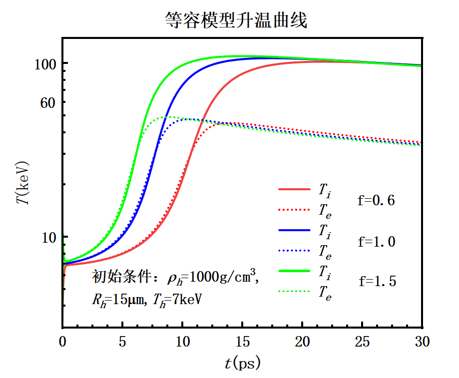

# Non-equbllirum Hot Spot
This program investigates the dynamic model of ICF, with seperated ion temperature and electron temperature. 

$$
\begin{aligned}
    C_{v,i} \rho_i \frac{\mathrm d T_i}{\mathrm d t}
&= W_\alpha f_{\alpha i} - W_{ie} - W_{m,i}, \\
   C_{v,e} \rho_e \frac{\mathrm d T_e}{\mathrm d t}
&= W_\alpha f_{\alpha e} + W_{ie} - W_{m,e} -W_r -W_e, \\
  \frac{\mathrm d \rho_h}{\mathrm d t}
&= \frac{W_r + W_e + W_\alpha(1-f_\alpha)/f_\alpha }{C_{v,i} T_i + C_{v,e}T_e}- \frac{ 4 \pi R_h^2 \rho_h u_h}{V_h}, \\
  \frac{\mathrm d R_h}{\mathrm d t} 
&= u_h,
\end{aligned}
$$
其中，公式三来源于热斑的质量演化方程：
$$
\frac{\mathrm d \rho_h V_h}{ \mathrm d t}
= \frac{[W_r + W_e + W_\alpha(1-f_\alpha)/f_\alpha ]V_h}{C_{v,i} T_i + C_{v,e}T_e}.
$$
选取演化参数$T_h,f,\rho_h, R_h$，这些物理量的意义是：
$$
T_h = \frac{T_i + T_e}{2},
    \quad f = T_i/T_h,
$$
## 等容模型和等压模型
等容模型中，热斑冲击波后速度满足：
$$
u_h
= \left( 
  \frac34\Gamma_B T_h \frac{\rho_h}{\rho_c} \right)^{1/2},
$$
而等压模型中假设为零速度。

同时，等容模型固定初值冷燃料和热斑的密度相等。
## 可视化等容与等压模型的演化
等压模型：

等容模型：

## 热斑的非平衡能量演化

