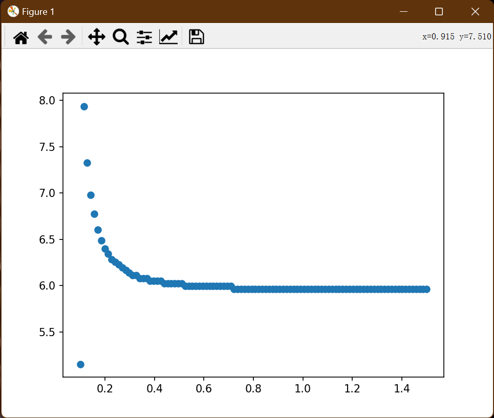

# Non-equbllirum Hot Spot
This program investigates the dynamic model of ICF, with seperated ion temperature and electron temperature. 

$$
\begin{aligned}
    C_{v,i} \rho_i \frac{\mathrm d T_i}{\mathrm d t}
&= W_\alpha f_{\alpha i} - W_{ie} - W_{m,i}, \\
   C_{v,e} \rho_e \frac{\mathrm d T_e}{\mathrm d t}
&= W_\alpha f_{\alpha e} + W_{ie} - W_{m,e} -W_r -W_e, \\
  \frac{\mathrm d \rho_h}{\mathrm d t}
&= \frac{W_r + W_e + W_\alpha(1-f_\alpha)/f_\alpha }{C_{v,i} T_i + C_{v,e}T_e}- \frac{ 4 \pi R_h^2 \rho_h u_h}{V_h}, \\
  \frac{\mathrm d R_h}{\mathrm d t} 
&= u_h,
\end{aligned}
$$
其中，公式三来源于热斑的质量演化方程：
$$
\frac{\mathrm d \rho_h V_h}{ \mathrm d t}
= \frac{[W_r + W_e + W_\alpha(1-f_\alpha)/f_\alpha ]V_h}{C_{v,i} T_i + C_{v,e}T_e}.
$$
选取演化参数$T_h,f,\rho_h, R_h$，这些物理量的意义是：
$$
T_h = \frac{T_i + T_e}{2},
    \quad f = T_i/T_h,
$$
## 等容模型和等压模型
等容模型中，热斑冲击波后速度满足：
$$
u_h
= \left( 
  \frac34\Gamma_B T_h \frac{\rho_h}{\rho_c} \right)^{1/2},
$$
而等压模型中假设为零速度。

同时，等容模型固定初值冷燃料和热斑的密度相等。
## 参考图


## Lawson判据
来自Atezni:
$$
\begin{aligned}
\rho_{\mathbf{h}}R_{\mathbf{h}}T_{\mathbf{h}}& >\frac{9\sqrt{3}}{4}\frac{\Gamma_{\mathrm{B}}^{3/2}T_{\mathrm{h}}^{5/2}}{A_{\alpha}\langle\sigma v\rangle-A_{\mathrm{b}}T_{\mathrm{h}}^{1/2}}\left(\frac{\rho_{\mathrm{h}}}{\rho_{\mathrm{c}}}\right)^{1/2}  \\
&=\frac{1.1T_\mathbf{h}^{1/2}}{1-3.47T_\mathbf{h}^{-3/2}}\left(\frac{\rho_\mathbf{h}}{\rho_\mathbf{c}}\right)^{1/2}\text{g/cm}^2,
\end{aligned}
$$
```
def Lawson(th, rhoh, rh):
    # print(th, rhoh, rh)
    lhs = rhoh/(10**3)*rh*100*th/11604525.0062
    if lhs>10:
        rhs = (1.1*np.sqrt(th/11604525.0062))/(1-3.47*(th/11604525.0062)**(-3/2))*np.sqrt(rhoh/Rhoc)
    else:
        rhs = 6*np.sqrt(rhoh/Rhoc)
    # print(lhs, rhs)
    # input("Press Enter to continue...")
    # rhs = 6*np.sqrt(rhoh/Rhoc)
    if lhs>rhs:
        return True
    return False
```

来自张老师：
$$
\rho_{\mathbf{h}}R_{\mathbf{h}}T_{\mathbf{h}}>6\left(\frac{\rho_\mathbf{h}}{\rho_\mathbf{c}}\right)^{1/2}\text{g/cm}^2
$$
两者在$T_h=28$keV左右衔接。
## 采取的判据
升温：
```
if Y[-1,1]>Y[-2,1]:
    if Y[-1,1]>Y[0,1]:
        return True
    # return True
    return False
```
使用Lawson判据：

在$0.7$g/cm$^2$处：


使用升温判据：


有趣的现象，在某些初值，$f=1$情形出现分叉


## 修改了比热
